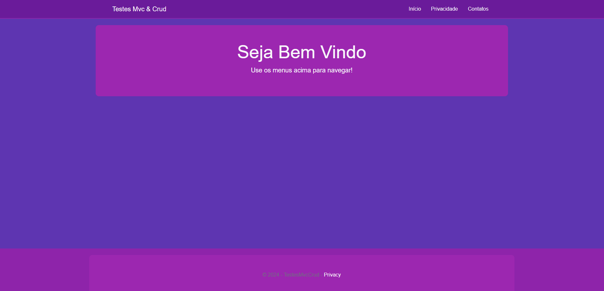
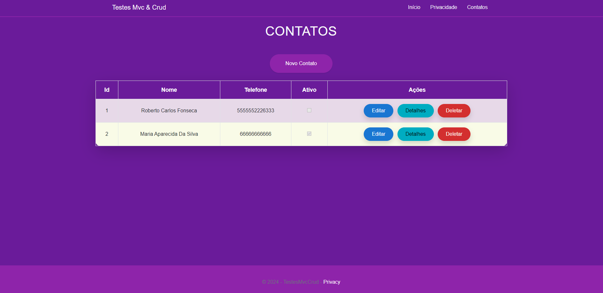
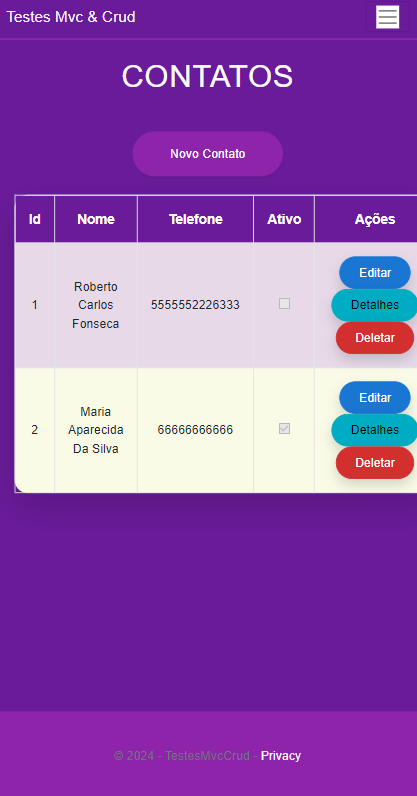
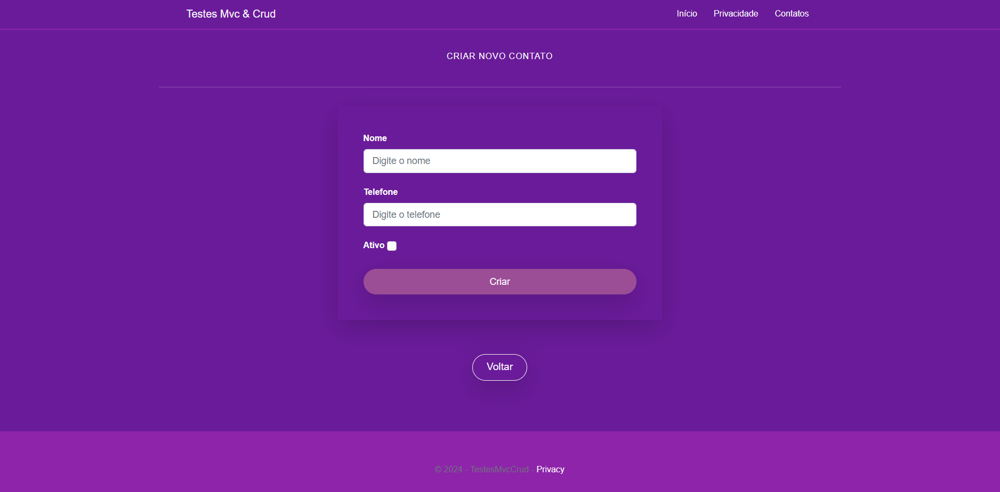
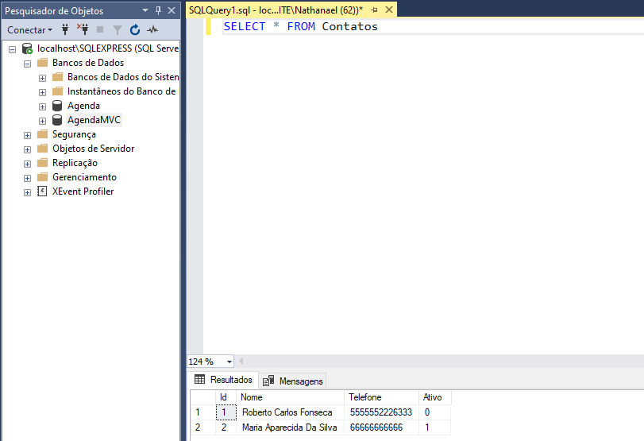
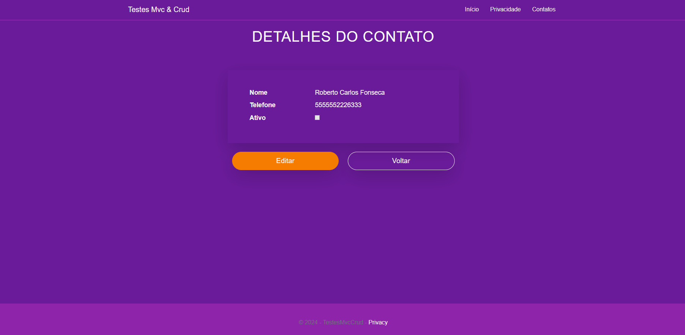
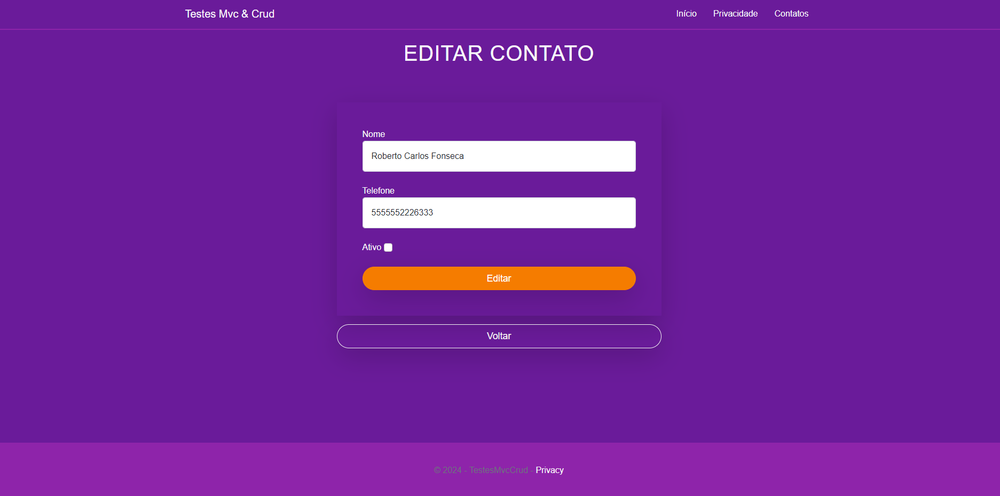

# Agenda de Contatos - ASP.NET Core MVC

**Aviso**: Este projeto é uma implementação de teste, não deve ser considerado como uma aplicação finalizada. Seu objetivo principal é demonstrar o uso de ASP.NET Core MVC e Entity Framework Core para um CRUD básico de contatos.

## Descrição

Este projeto consiste em uma **aplicação web MVC** que permite o gerenciamento de contatos, com funcionalidades para **adicionar**, **editar**, **excluir** e **visualizar** contatos armazenados em um banco de dados.

## Funcionalidades

- **CRUD de Contatos**: 
  - **Create**: Adiciona novos contatos.
  - **Read**: Exibe a lista de contatos ou detalhes de um contato específico.
  - **Update**: Atualiza informações de um contato.
  - **Delete**: Exclui contatos da lista.
  
- **Interface Responsiva**: Utiliza o Bootstrap para garantir uma interface adaptável a diferentes dispositivos.

## Tecnologias Utilizadas

- **ASP.NET Core MVC**: Framework web para a construção da aplicação.
- **Entity Framework Core**: ORM para facilitar a comunicação com o banco de dados.
- **SQL Server**: Banco de dados relacional para armazenamento dos dados.
- **Bootstrap**: Framework CSS para estilização responsiva.

## Como Rodar

### Pré-requisitos

- **.NET SDK 6.0 ou superior**
- **SQL Server**

### Passos para Execução

1. Clone este repositório:
   ```bash
   git clone https://github.com/seu-usuario/nome-do-repositorio.git
2. Navegue até o diretório do projeto:
    ```bash
    cd nome-do-repositorio
    ```

3. Restaure as dependências do projeto:
    ```bash
    dotnet restore
    ```

4. Atualize a string de conexão no arquivo `appsettings.json` com as credenciais do seu SQL Server.

5. Crie e aplique a migração do banco de dados:
    ```bash
    dotnet ef database update
    ```

6. Execute o projeto:
    ```bash
    dotnet run ou dotnet watch run
    ```


## Estrutura do Projeto

- **Controllers**: Contém os controladores responsáveis pela lógica de manipulação das operações CRUD.
  - `ContatoController.cs`: Controlador que gerencia as operações CRUD de contatos.
  
- **Models**: Contém as classes que representam as entidades do banco de dados.
  - `Contato.cs`: Define o modelo de dados de um contato.

- **Views**: Contém as páginas (views) que são renderizadas para o usuário no navegador.
  - `Index.cshtml`: Exibe a lista de contatos.
  - `Criar.cshtml`: Formulário para adicionar um novo contato.
  - `Editar.cshtml`: Formulário para editar um contato existente.
  - `Detalhes.cshtml`: Exibe as informações detalhadas de um contato específico.
  - `Deletar.cshtml`: Exibe a página de confirmação de exclusão de um contato.

## Contribuições

Sinta-se à vontade para abrir **issues** e **pull requests**!


## Imagens do Projeto











